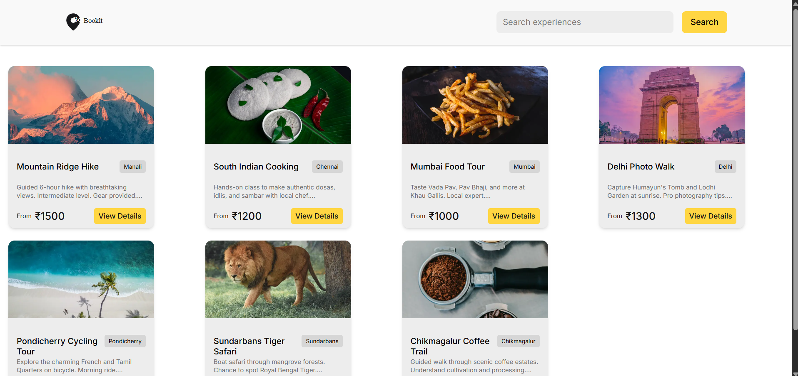
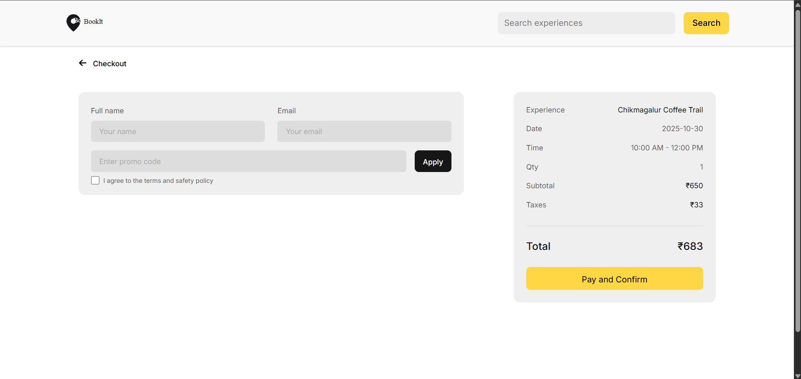
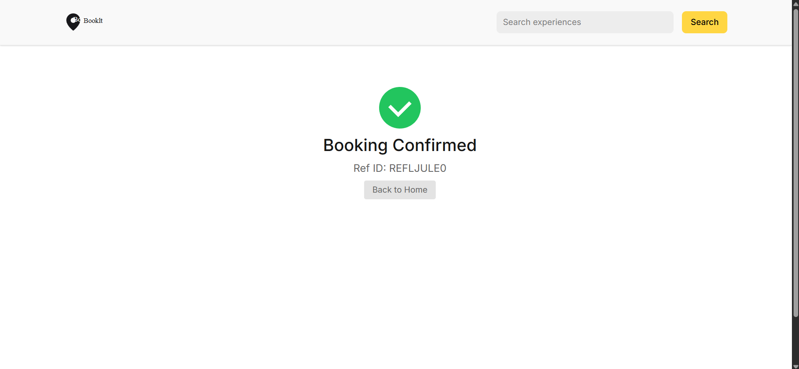

# 🌍 BookIt: Experiences & Slots

BookIt is a **fullstack booking platform** built with **Next.js (App Router)**, **TypeScript**, **TailwindCSS**, and **MongoDB (Atlas)**.  
It allows users to **explore experiences**, view **available dates & time slots**, apply **promo codes**, and **book experiences** end-to-end — from browsing to checkout confirmation.

---

## 🚀 Tech Stack

| Layer | Technology |
|--------|-------------|
| **Frontend** | Next.js 14 (React + TypeScript) |
| **Styling** | TailwindCSS |
| **Backend** | Next.js API Routes |
| **Database** | MongoDB Atlas (Mongoose ODM) |
| **API Communication** | Native Fetch API |
| **Deployment** | Vercel |

---

## ✨ Core Features

- 🏝️ **Dynamic Experience Listing** — Fetch experiences from MongoDB.  
- 📅 **Date & Time Slot Selection** — Book available slots dynamically.  
- 💳 **Checkout Flow** — Confirm booking details with live price summary.  
- 🎟️ **Promo Code Validation** — Apply and validate coupons from database.  
- ✅ **Booking Confirmation Page** — Displays final success message with reference ID.  
- 📱 **Fully Responsive** — Designed with TailwindCSS for all breakpoints.  

---

## 🧩 Project Structure

```

├── src/
│   ├── app/
│   │   ├── api/                # All backend routes (Next.js API)
│   │   │   ├── experiences/    # Experience APIs (GET /experiences, GET /:id)
│   │   │   ├── bookings/       # Booking creation (POST)
│   │   │   └── promo/validate  # Promo validation API
│   │   ├── experience/[id]/    # Experience details page
│   │   ├── checkout/           # Checkout flow
│   │   └── success/            # Booking confirmation page
│   ├── components/             # Reusable UI components
│   ├── lib/                    # Database connection & models
│   ├── types/                  # TypeScript interfaces
│   └── styles/                 # Global styles

````

---

## ⚙️ Local Setup

Follow these steps to run the project locally:

### 1️⃣ Clone the repository
```bash
git clone https://github.com/abdullahxtech/bookIt.git
cd booklt
````

### 2️⃣ Install dependencies

```bash
npm install
# or
yarn install
```

### 3️⃣ Configure environment variables

Create a `.env.local` file in the root of your project and add the following:

```bash
MONGODB_URI="your_mongodb_atlas_connection_string"
NEXT_PUBLIC_BASE_URL="http://localhost:3000"
```

> 📝 Use **MongoDB Atlas** for hosting the database.
> This app is designed for a **remote MongoDB connection**, not local MongoDB.

### 4️⃣ Run the development server

```bash
npm run dev
# or
yarn dev
```

Your app will now be live at 👉 [http://localhost:3000](http://localhost:3000)

---

## 🌐 Deployment (Vercel)

This project is designed to deploy directly to **Vercel**:

1. Push your project to GitHub.
2. Go to [Vercel Dashboard](https://vercel.com).
3. Import your repository.
4. Add your environment variable:

   * `MONGODB_URI` — MongoDB Atlas connection string.
5. Click **Deploy**.
6. Your live app will be available instantly.

🟢 **Live Demo:** [https://book-it-experience-and-slots.vercel.app/](https://book-it-experience-and-slots.vercel.app/)

---

## 🧠 API Overview

| Method | Endpoint               | Description                     |
| ------ | ---------------------- | ------------------------------- |
| `GET`  | `/api/experiences`     | Fetch all experiences           |
| `GET`  | `/api/experiences/:id` | Fetch a single experience by ID |
| `POST` | `/api/bookings`        | Create a new booking            |
| `POST` | `/api/promo/validate`  | Validate a promo code           |

---

## 📷 Screenshots

| Page                  | Preview                                      |
| --------------------- | -------------------------------------------- |
| 🏠 Home               |          |
| 📄 Experience Details |    |
| 💳 Checkout           |  |
| ✅ Success             |    |

---

## 🧑‍💻 Author

**Abdullah**
💼 Fullstack Developer (MERN + Next.js)
📧 [abdullah195307@gmail.com](mailto:abdullah195307@gmail.com)
🔗 [GitHub](https://github.com/YOUR_USERNAME) | [LinkedIn](https://linkedin.com/in/YOUR_LINKEDIN)

---

## 📝 License

This project is licensed under the **MIT License** — feel free to use and modify it.

---

> *Built with ❤️ using Next.js, TypeScript & MongoDB Atlas.*


